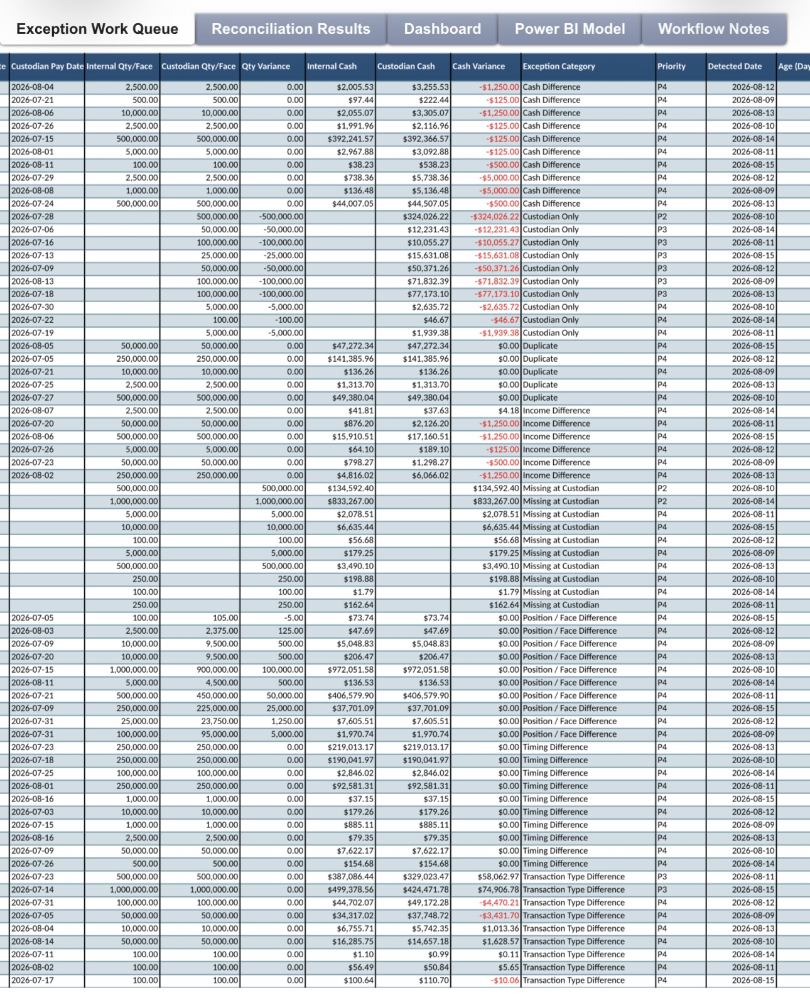
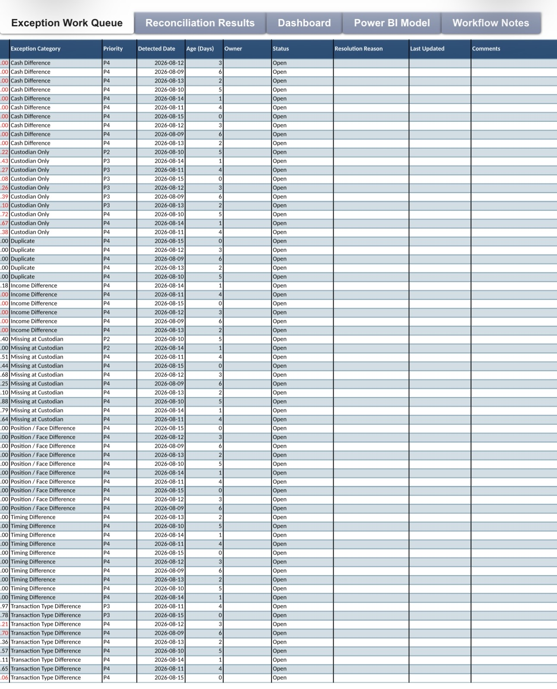
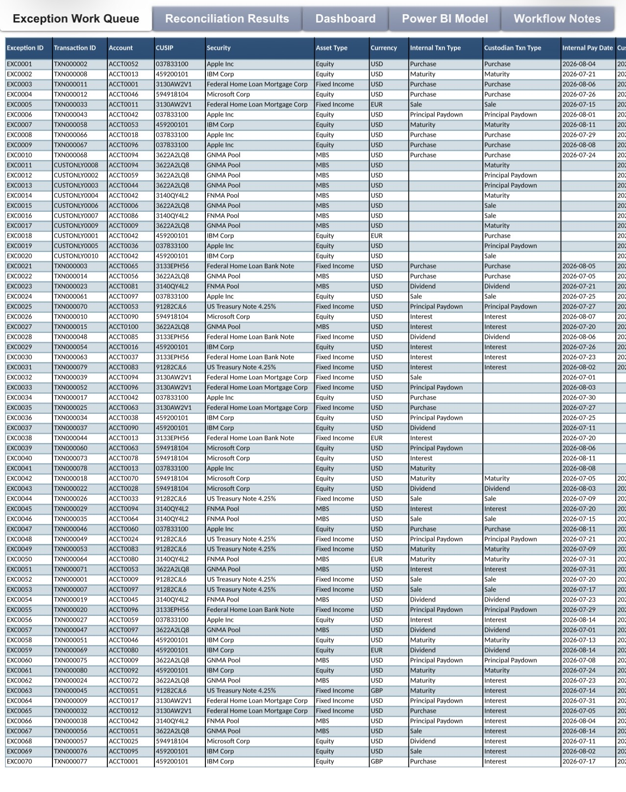
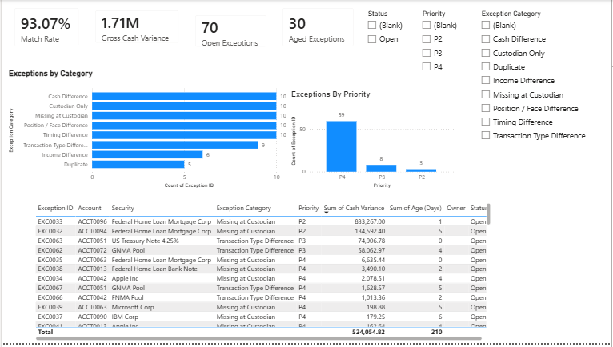

# Investment Reconciliation & Exception Management

## Overview

This project demonstrates an exception-based investment reconciliation workflow designed to identify, classify, and prioritize reconciliation breaks between internal accounting records and external custodian data.

Rather than requiring an analyst to manually review an entire population of transactions, the workflow separates successfully reconciled records from exceptions so operational attention can be focused on items requiring investigation.

A Power BI reporting layer provides visibility into the resulting exception population and helps support prioritization, root-cause analysis, and operational oversight.

## Business Problem

Investment operations teams routinely reconcile internal books and records against external custodians and other data providers.

Traditional workflows can require analysts to review large populations of data even when the majority of records reconcile successfully. The operational challenge is therefore not simply comparing two datasets, but efficiently identifying the records that require human investigation.

This project was designed around a simple principle:

**Automate the comparison. Focus the analyst on the exception.**

## Workflow

Internal Accounting Data  

↓  

External Custodian Data  

↓  

**Reconciliation / Matching Logic**  

↓  

Matched Records → No Further Investigation  

↓  

Unmatched Records → **Exception Population**  

↓  

**Exception Classification & Prioritization**  

↓  

Analyst Investigation  

↓  

**Power BI Reporting & Operational Oversight**

## Exception Management

The workflow is designed to identify and organize reconciliation discrepancies such as:

- Cash differences

- Position differences

- Income discrepancies

- Missing transactions

- Timing differences

- Quantity differences

- Amount differences

- Internal-only records

- Custodian-only records

Exceptions can then be categorized and analyzed rather than requiring analysts to manually review the full transaction population.

## Reconciliation & Exception Management Output

The Excel workflow provides the operational layer underneath the Power BI dashboard. These views demonstrate how transaction-level internal and custodian data is transformed into a categorized and actionable exception population.

### Transaction-Level Reconciliation Detail

Each exception retains the transaction-level attributes required for investigation, including exception and transaction IDs, account, CUSIP, security, asset type, currency, internal and custodian transaction types, and relevant processing dates.

### Internal vs. Custodian Comparison & Exception Classification

The reconciliation logic compares internal and custodian records, calculates quantity/face and cash variances, and applies exception categories so breaks can be routed for investigation.

### Exception Work Queue

The exception work queue converts identified reconciliation breaks into an operational workflow by assigning priority and tracking exception age, ownership, status, resolution reason, last update, and supporting comments.

Together, these views demonstrate the progression from transaction-level reconciliation, to exception identification and classification, to an operational work queue for investigation and resolution.

---

## Power BI Reporting Layer

The Power BI layer provides a consolidated view of reconciliation results and exception activity.

The reporting layer is designed to help users:

- Monitor total reconciliation exceptions

- Analyze exceptions by category

- Identify recurring break types

- Prioritize unresolved items

- Evaluate exception trends

- Support operational and management oversight

## Business Value

An exception-based approach can improve reconciliation operations by:

- Reducing unnecessary manual review

- Directing analyst attention toward genuine discrepancies

- Creating consistent exception classifications

- Improving visibility into reconciliation risk

- Supporting root-cause analysis

- Identifying recurring operational issues

- Providing management with actionable reconciliation metrics

- Creating a scalable framework for additional automation

## Tools & Technologies

- Microsoft Excel

- Power Query

- Power BI

- Reconciliation and matching logic

- Data transformation

- Exception classification

- Operational reporting

## Project Context

This is an independent portfolio project built with synthetic/sample data to demonstrate investment reconciliation, exception-management, data-analysis, and process-improvement concepts.

The design is informed by professional experience working with investment operations, reconciliation, custodian data, exception investigation, and process improvement.

No proprietary employer or client data is used in this project.

## About Me

**Gianmarco Napolitano**

Investment operations professional with 5+ years of experience across investment reconciliation, exception management, investment income, fixed income operations, corporate actions, custodian data, and operational process improvement.

[LinkedIn](https://www.linkedin.com/in/gianmarco-napolitano-9470363b5)
