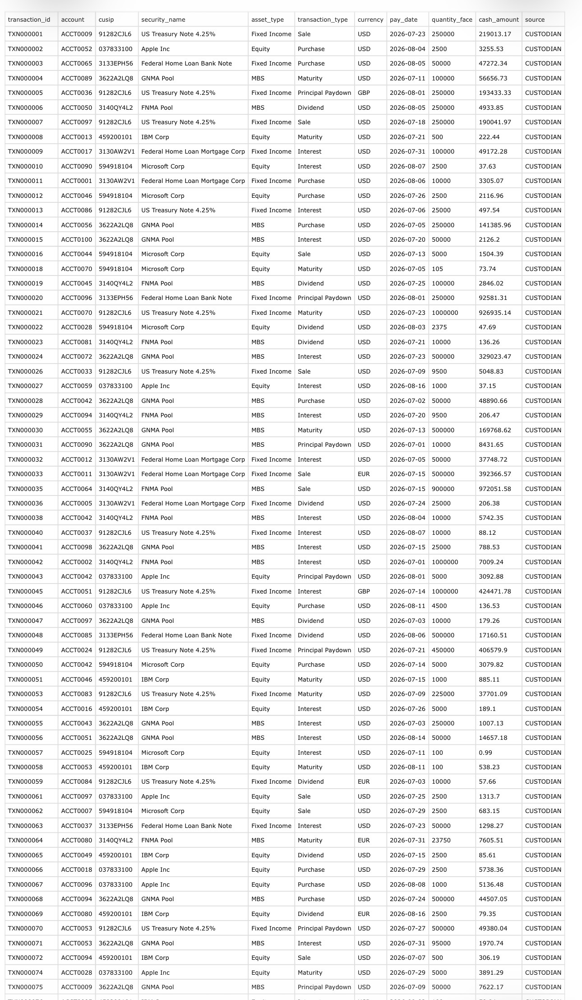

# Investment Reconciliation & Exception Management

## Overview

This project demonstrates an exception-based investment reconciliation workflow designed to identify, classify, and prioritize reconciliation breaks between internal accounting records and external custodian data.

Rather than requiring an analyst to manually review an entire population of transactions, the workflow separates successfully reconciled records from exceptions so operational attention can be focused on items requiring investigation.

A Power BI reporting layer provides visibility into the resulting exception population and helps support prioritization, root-cause analysis, and operational oversight.

## Business Problem

Investment operations teams routinely reconcile internal books and records against external custodians and other data providers.

Traditional workflows can require analysts to review large populations of data even when the majority of records reconcile successfully. The operational challenge is therefore not simply comparing two datasets, but efficiently identifying the records that require human investigation.

This project was designed around a simple principle:

**Automate the comparison. Focus the analyst on the exception.**

## Workflow

Internal Accounting Data  

↓  

External Custodian Data  

↓  

**Reconciliation / Matching Logic**  

↓  

Matched Records → No Further Investigation  

↓  

Unmatched Records → **Exception Population**  

↓  

**Exception Classification & Prioritization**  

↓  

Analyst Investigation  

↓  

**Power BI Reporting & Operational Oversight**

## Exception Management

The workflow is designed to identify and organize reconciliation discrepancies such as:

- Cash differences

- Position differences

- Income discrepancies

- Missing transactions

- Timing differences

- Quantity differences

- Amount differences

- Internal-only records

- Custodian-only records

Exceptions can then be categorized and analyzed rather than requiring analysts to manually review the full transaction population.

## Reconciliation Workflow: Source Data to Exception Management

This project begins with two independent transaction populations: internally maintained investment accounting records and custodian records. The reconciliation process compares these datasets at the transaction level, identifies differences, calculates variances, classifies exceptions, and converts those exceptions into an operational work queue.

### 1. Internal Books

The internal dataset represents the transaction records maintained within the investment accounting environment. Each record contains the attributes required for reconciliation, including transaction ID, account, CUSIP, security, asset type, transaction type, currency, pay date, quantity/face value, and cash amount.

The complete source dataset is also available in [`internal_books.csv`](internal_books.csv).

### 2. Custodian Records

The custodian dataset represents the corresponding transaction population received from the external custodian. It contains the same core reconciliation attributes, allowing the two datasets to be compared systematically.

The complete source dataset is also available in [`custodian_records.csv`](custodian_records.csv).

### 3. Reconciliation & Exception Output

The reconciliation process compares the internal and custodian populations and produces a unified transaction-level result. Rather than requiring an analyst to manually compare the two source files, the workflow surfaces the relevant differences and organizes them for investigation.

The following three screenshots show the reconciliation output from left to right across the Excel work queue.

#### Transaction Identification & Security Details

The first section preserves the identifying attributes needed to investigate each exception, including exception ID, transaction ID, account, CUSIP, security, asset type, currency, and the internal and custodian transaction types.

#### Internal vs. Custodian Comparison & Exception Classification

The second section places internal and custodian values side by side, calculates quantity/face and cash variances, and assigns an exception category and priority. This converts raw reconciliation differences into identifiable break types that can be investigated systematically.

#### Exception Management & Resolution Tracking

The final section converts identified breaks into an operational exception-management workflow. Each exception includes its category, priority, detected date, age, owner, status, resolution reason, last update, and supporting comments.

Together, these views demonstrate the full operational progression:

**Internal Books → Custodian Records → Transaction Matching → Variance Detection → Exception Classification → Prioritization → Investigation & Resolution**

The resulting exception population then feeds the reporting layer below, where Power BI provides management-level visibility into reconciliation performance, outstanding exceptions, aging, financial exposure, and exception trends.

---

## Power BI Reporting Layer

The Power BI layer provides a consolidated view of reconciliation results and exception activity.

The reporting layer is designed to help users:

- Monitor total reconciliation exceptions

- Analyze exceptions by category

- Identify recurring break types

- Prioritize unresolved items

- Evaluate exception trends

- Support operational and management oversight

## Business Value

An exception-based approach can improve reconciliation operations by:

- Reducing unnecessary manual review

- Directing analyst attention toward genuine discrepancies

- Creating consistent exception classifications

- Improving visibility into reconciliation risk

- Supporting root-cause analysis

- Identifying recurring operational issues

- Providing management with actionable reconciliation metrics

- Creating a scalable framework for additional automation

## Tools & Technologies

- Microsoft Excel

- Power Query

- Power BI

- Reconciliation and matching logic

- Data transformation

- Exception classification

- Operational reporting

## Project Context

This is an independent portfolio project built with synthetic/sample data to demonstrate investment reconciliation, exception-management, data-analysis, and process-improvement concepts.

The design is informed by professional experience working with investment operations, reconciliation, custodian data, exception investigation, and process improvement.

No proprietary employer or client data is used in this project.

## About Me

**Gianmarco Napolitano**

Investment operations professional with 5+ years of experience across investment reconciliation, exception management, investment income, fixed income operations, corporate actions, custodian data, and operational process improvement.

[LinkedIn](https://www.linkedin.com/in/gianmarco-napolitano-9470363b5)
